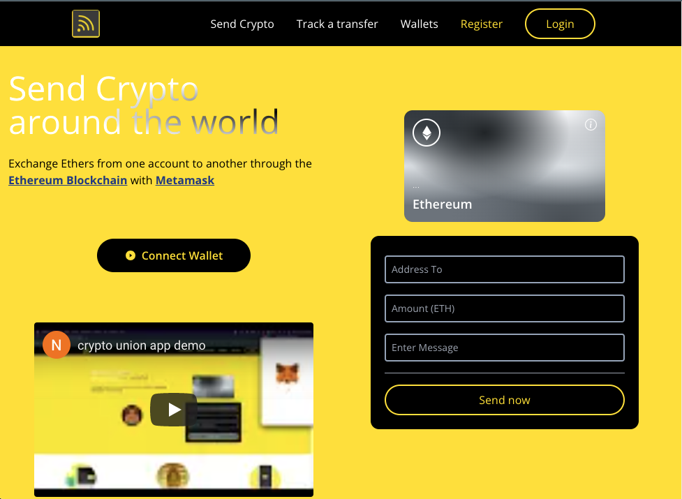
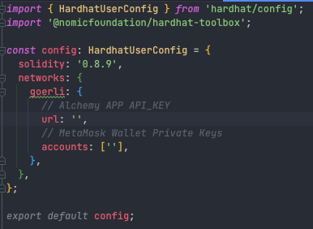
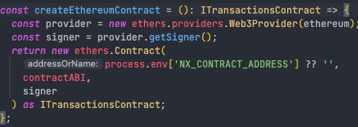

# Crypto Union APP

This project was generated using [Nx](https://nx.dev).

The main purpose is to transfer Ethers from you Metamask Ethereum Wallet to another Wallet Account using Ethereum Blockchain

App is deployed and ready to be used on link:
https://crypto-union.netlify.app/

## Pre-requirements to run on localhost the app
Goerli APP API_KEY from https://dashboard.alchemyapi.io/

Metamask Wallet Private Keys. You can download the wallet from here https://metamask.io/download/

Free Ethers for testing. You can get them from here https://goerlifaucet.com/

Once you have the Goerli APP API_KEY and MetaMask installed, you need to fill the missing data in ./smart-contract/hardhat.config.ts

Deploy the smart contract from smart-contract/contracts/Transactions.sol running from root the command yarn --cwd smart-contract deploy

if everything is successful in the command line you will see a deployment number, this is the contract address where de 
contract was deployed inside the Ethereum Blockchain. You need to take this value and replace the variable 
process.env['NX_CONTRACT_ADDRESS'] in apps/client/src/app/context/TransactionsContextProvider for the deployed contract address

## Development server

Run `nx serve client` for a dev server. Navigate to http://localhost:4200/. The app will automatically reload if you change any of the source files.

## Build

Run `nx build client` to build the project. The build artifacts will be stored in the `dist/` directory. Use the `--prod` flag for a production build.

## Running unit tests

Run `nx test client` to execute the unit tests via [Jest](https://jestjs.io).

Run `nx affected:test` to execute the unit tests affected by a change.

## Running end-to-end tests

Run `nx e2e client` to execute the end-to-end tests via [Cypress](https://www.cypress.io).

Run `nx affected:e2e` to execute the end-to-end tests affected by a change.

## Understand your workspace

Run `nx graph` to see a diagram of the dependencies of your projects.

## Further help

Visit the [Nx Documentation](https://nx.dev) to learn more.

